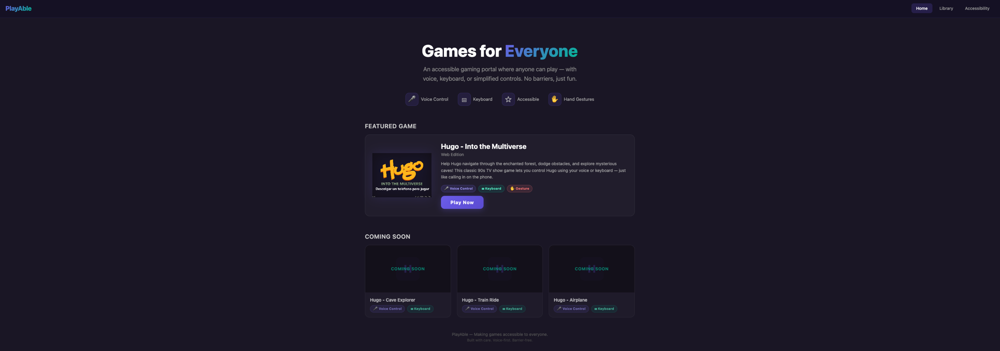
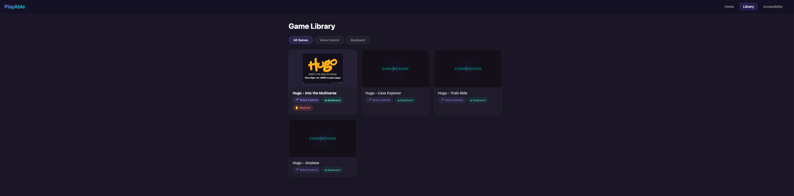
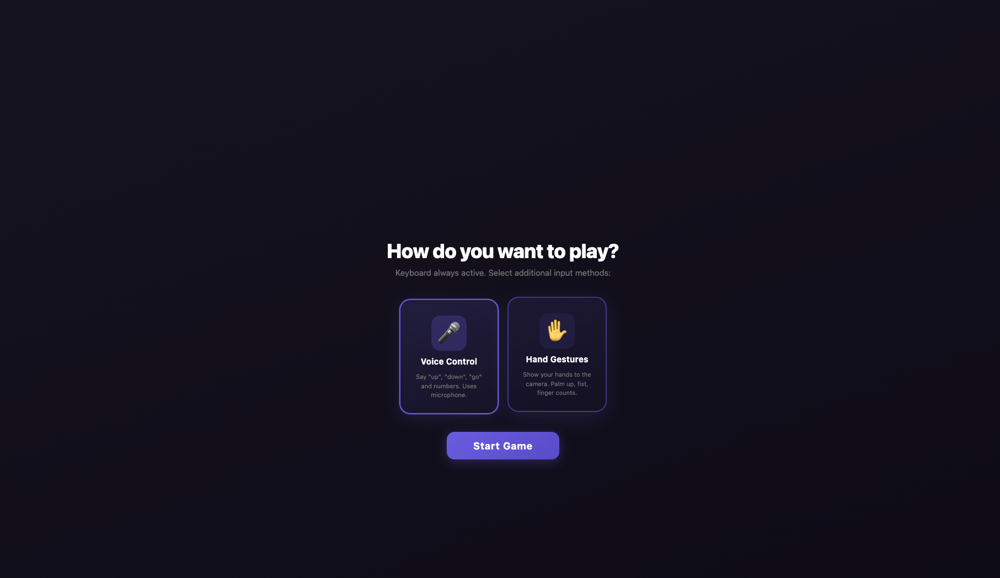
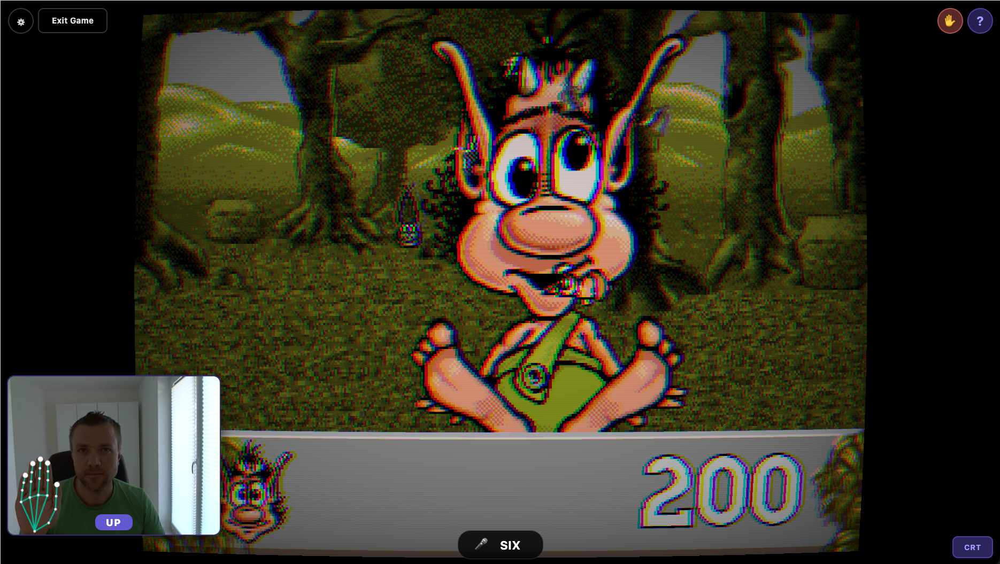

# PlayAble - Accessible Gaming Portal

**Live Demo: [web-beige-five-74.vercel.app](https://web-beige-five-74.vercel.app/)**

PlayAble is an accessible gaming portal built during a hackathon in Heilbronn (March 2026). It transforms classic retro games into an inclusive web experience with multiple input methods — keyboard, voice commands, and hand gesture recognition — so everyone can play.

The first game featured is **Hugo - Into the Multiverse**, a reimplementation of the beloved 90s Hugo TV show minigames where players help Hugo navigate through an enchanted forest and mysterious caves.

## Screenshots

| Portal Home | Game Library |
|:-----------:|:------------:|
|  |  |

| Input Selection | Gameplay with Hand Gestures |
|:---------------:|:---------------------------:|
|  |  |

## Features

- **Multi-Input Controls**: Play using keyboard, voice, camera-based hand gestures, or any combination simultaneously
- **Voice Recognition**: TensorFlow.js Speech Commands model runs entirely in-browser (~4MB, 18 words) — say "up", "down", "go", "three", "six", "nine" to play
- **Hand Gesture Recognition**: MediaPipe Hands via WebAssembly tracks hand landmarks in real-time with a live PiP overlay. Open hand = jump, fist = duck, finger counts for rope selection
- **Adjustable Game Speed**: Slow down or speed up gameplay via an in-game slider
- **CRT Shader Effect**: Optional retro TV scanline overlay for that authentic 90s feel
- **Portal UI**: SPA with home page, game library, game detail pages with control descriptions, and accessibility settings
- **Easter Egg**: Form a heart shape with both hands in front of the camera :)

## Input Methods

| Input | Controls |
|-------|----------|
| **Keyboard** | Arrow keys / WASD to move, Space to confirm, 3/6/9 for ropes, Shift to skip |
| **Voice** | "up" / "down" to move, "go" to start, "three" / "six" / "nine" for ropes |
| **Gesture** | Open hand = jump, Fist = duck, Thumbs up = confirm, 3/6/8 fingers for ropes |

## Running

```bash
# 1. Convert game assets (requires Hugo Gold edition RAR + ffmpeg + Pillow)
cd web
python3 convert_assets.py

# 2. Serve locally
python3 -m http.server 8080

# 3. Open in Chrome (best Speech API and MediaPipe support)
open http://localhost:8080
```

The Hugo Gold edition RAR ("A jugar con Hugo - Edicion dorada (1.01).rar") must be placed in the repo root before running the converter. Game assets are not included in this repository.

## Tech Stack

- **Frontend**: Vanilla HTML5 Canvas + ES Modules (no framework)
- **Voice**: TensorFlow.js Speech Commands (18w model, in-browser)
- **Gestures**: MediaPipe Tasks Vision HandLandmarker (WebAssembly, GPU-accelerated)
- **Audio**: Web Audio API with preloaded MP3 buffers
- **Video**: HTML5 `<video>` element drawn to canvas
- **Routing**: Hash-based SPA router

## Project Structure

```
web/
  index.html              # Portal shell + game container
  style.css               # Game styles + heart particle animations
  portal.css              # Portal page styles + design system
  convert_assets.py       # Asset converter (RAR -> PNG/MP3/MP4)
  js/
    main.js               # Game init, multi-input setup, settings UI
    portal.js             # SPA router + portal pages
    game-catalog.js       # Game metadata registry
    gesture.js            # MediaPipe hand tracking + gesture mapping
    speech.js             # TF.js voice recognition
    config.js             # Game config (speed, screen size, keys)
    audio.js              # Web Audio API playback
    state.js              # Base state machine class
    tv-show/              # TV show flow states (attract -> playing -> cave -> scoreboard)
    forest/               # Forest runner minigame
    cave/                 # Cave climbing minigame
```

## Acknowledgments

This project builds on [hugo-re](https://github.com/gzalo/hugo-re) by [@gzalo](https://github.com/gzalo) (Gonzalo Avila) — an impressive reverse-engineering effort that decoded the original Hugo game's proprietary file formats (CGF sprites, TIL tilesets, LZP compression, OOS animation sync) and reimplemented the game logic in Python. The web port started from that foundation and added the portal UI, voice recognition, and hand gesture controls on top. Thank you for making this possible!

## License

Game assets belong to their respective copyright holders. This project is for educational and hackathon demonstration purposes.
